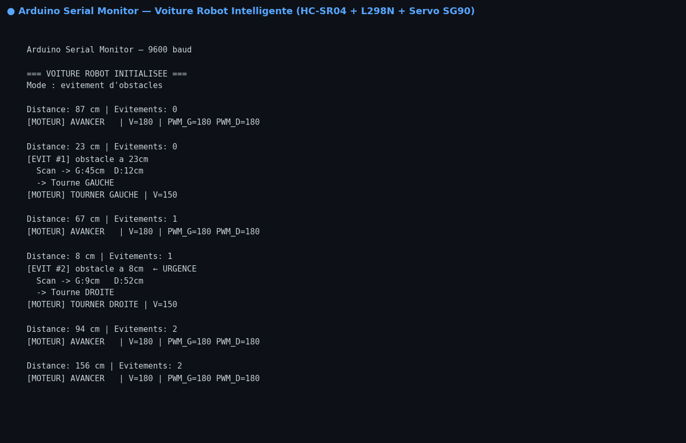

# 🤖 Voiture Robot Intelligente — Arduino Uno

Voiture robot autonome capable d'éviter les obstacles en temps réel grâce à un capteur ultrason HC-SR04 monté sur servo SG90, avec mode secondaire de suivi de ligne via capteurs IR TCRT5000.

## 📸 Aperçu — Serial Monitor Arduino



## 🎯 Fonctionnalités

- **Évitement d'obstacles** : détection HC-SR04 → balayage servo gauche/droite → choix de la meilleure direction
- **Recul d'urgence** : si distance < 10 cm, stop immédiat + recul avant rotation
- **Suivi de ligne** : 2 capteurs IR sol TCRT5000 (mode activable)
- **Feedback Serial Monitor** : distance + nombre d'évitements en temps réel
- Vitesse réglable par PWM via driver L298N

## 🔧 Matériel

| Composant | Référence | Rôle |
|-----------|-----------|------|
| Microcontrôleur | Arduino Uno (ATmega328P) | Cerveau du robot |
| Driver moteurs | L298N | Commande 2 moteurs DC |
| Capteur distance | HC-SR04 | Détection obstacle (2–400 cm) |
| Servo | SG90 | Rotation tête capteur (scan G/D) |
| Capteurs IR | TCRT5000 × 2 | Suivi de ligne |
| Moteurs | DC 6V / 200 RPM × 2 | Propulsion |
| Alimentation | LiPo 7,4V 1500 mAh | Source énergie |

## 📌 Schéma de câblage

```
Arduino Uno
├── D2  → L298N IN1  (Moteur Gauche — avant)
├── D3  → L298N IN2  (Moteur Gauche — arrière)
├── D4  → L298N IN3  (Moteur Droit  — avant)
├── D5  → L298N IN4  (Moteur Droit  — arrière)
├── D10 → L298N ENA  (PWM vitesse gauche)
├── D11 → L298N ENB  (PWM vitesse droite)
├── D7  → HC-SR04 TRIG
├── D8  → HC-SR04 ECHO
├── D9  → Servo SG90 Signal
├── A0  → TCRT5000 Gauche (OUT)
└── A1  → TCRT5000 Droite (OUT)
```

## 📚 Librairies requises

```
NewPing   — Gestionnaire de bibliothèques Arduino IDE
Servo     — Intégrée Arduino IDE
```

## 🚀 Téléversement

1. Ouvrir `voiture_robot/voiture_robot.ino` dans **Arduino IDE**
2. Sélectionner **Arduino Uno** + port COM
3. **Vérifier** → **Téléverser**
4. Ouvrir **Serial Monitor** à **9600 baud**

## ⚙️ Paramètres configurables

```cpp
#define DISTANCE_OBSTACLE  25   // cm : début évitement
#define DISTANCE_URGENCE   10   // cm : recul immédiat
#define VITESSE_NORMALE   180   // PWM 0–255
#define VITESSE_ROTATION  150   // vitesse rotation
#define DELAI_ROTATION    350   // ms
```

## 🛠️ Technologies

**C++ Arduino** · **NewPing** · **Servo** · **PWM** · **I/O numérique**

## 👩‍💻 Auteure

**Vanelle Stéphanie MANGOUA DJOUSSEU** — Recherche d'alternance en IA & Systèmes Embarqués
